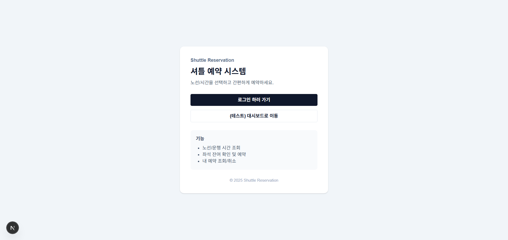
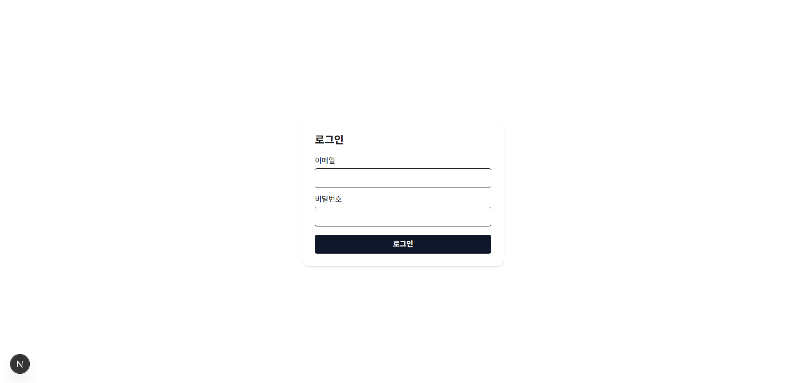
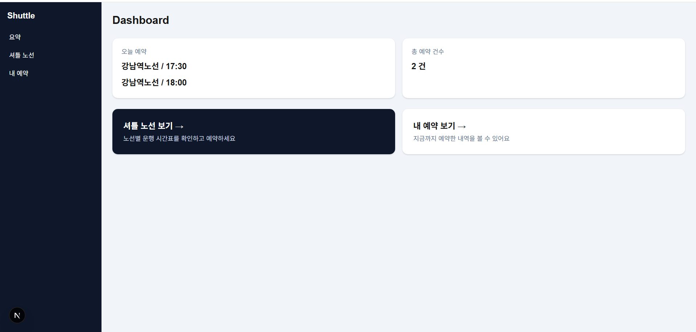
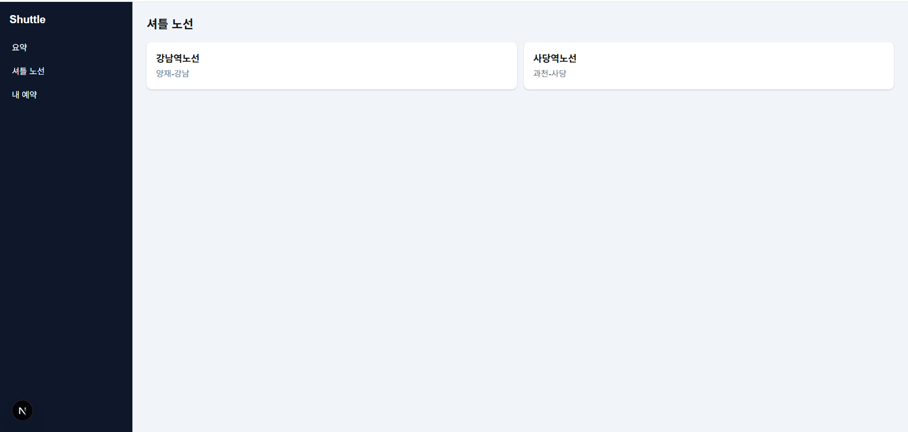
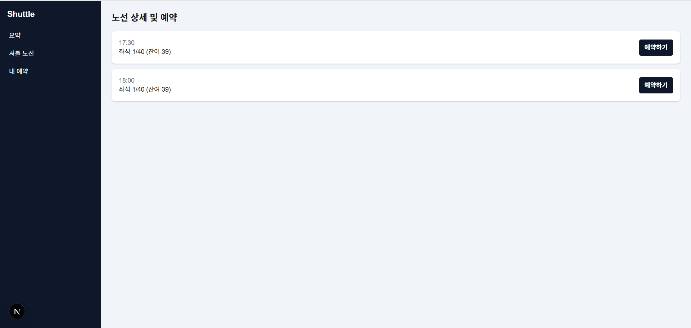
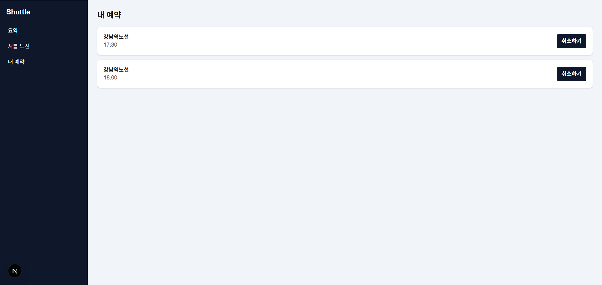

# Shuttle Booking Frontend

## Overview

사내 임직원을 위한 통근 셔틀 예약 시스템 프론트엔드 포트폴리오입니다.
노선 조회 → 운행 시간 선택 → 잔여 좌석 확인 → 예약/취소까지의 전체 흐름을 구현했습니다.

---

## Screenshots

> 실제 구현 화면 캡처

- 노선 목록 / 운행 시간 조회
- 노선 상세 (잔여 좌석 표시)
- 예약 / 취소 UI


### 처음 화면


### 로그인


### 대시보드


### 셔틀 조회


### 예약


### 예약 취소



---

## Stack

- Next.js 14 (App Router)
- TypeScript
- JWT (Cookie 기반 인증)

---

## Key Features

### 1. 노선 및 운행 시간 조회

- 노선(routeId) 기준 운행(trips) 목록 조회
- 좌석 현황 표시 (예약 수 / 최대 좌석 / 잔여 좌석)

### 2. 셔틀 예약

- 잔여 좌석이 0일 경우 예약 버튼 비활성화
- 예약 성공 시 서버 데이터 재조회로 화면 즉시 동기화

### 3. 예약 취소

- 사용자 확인(confirm) 후 취소 요청
- 취소 성공 시 알림 노출 후 `router.refresh()` 실행

### 4. 인증/인가 처리

- JWT를 **쿠키 기반**으로 전달
- `fetch` 호출 시 `credentials: 'include'` 사용
- 인증 실패 시 에러 메시지 처리

---

## Architecture (Frontend)

- **Server Component**
  - 초기 데이터 로딩 (노선/운행 정보)
  - SEO 및 초기 렌더링 최적화
- **Client Component**
  - 예약/취소 액션 처리
  - 사용자 인터랙션 담당

```text
Server (page.tsx)
  ↓ fetch
Client (BookingForm)
  → POST / cancel
  → router.refresh()
```

---

## Folder Structure

```bash
app/
  dashboard/
    shuttles/
      [id]/
        page.tsx        # 노선 상세 + 운행 목록 (Server Component)
        BookingForm.tsx # 예약/취소 버튼 (Client Component)
```

---


## Backend Repository

- Backend: https://github.com/dnd194/reserve_back.git

